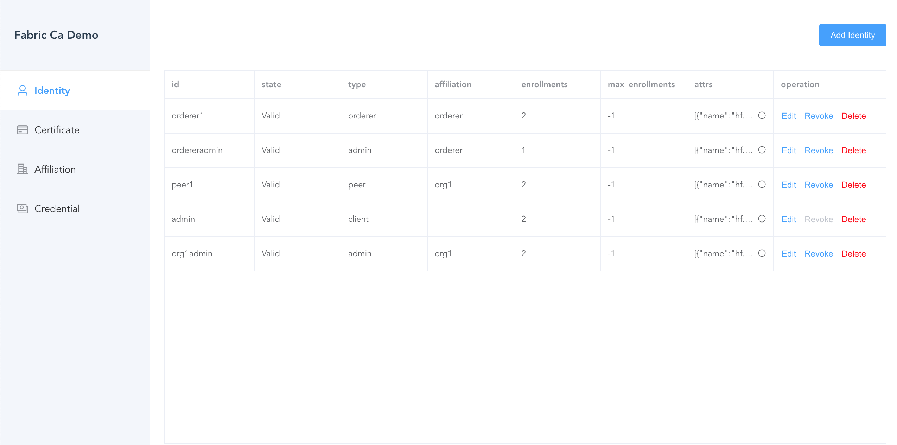
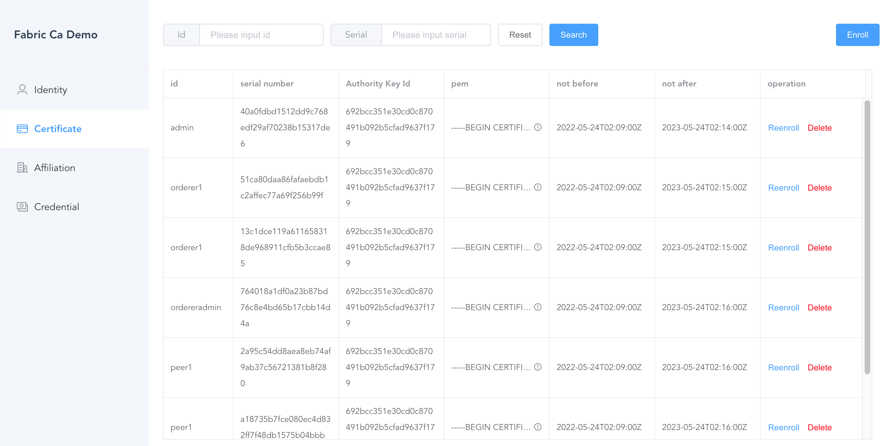
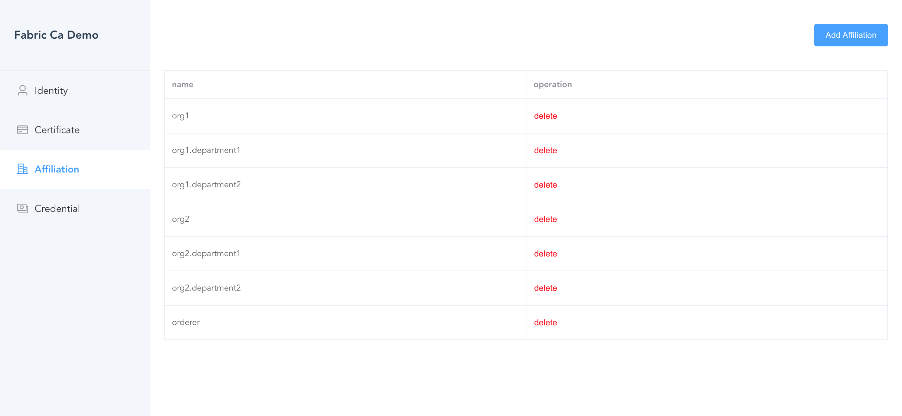
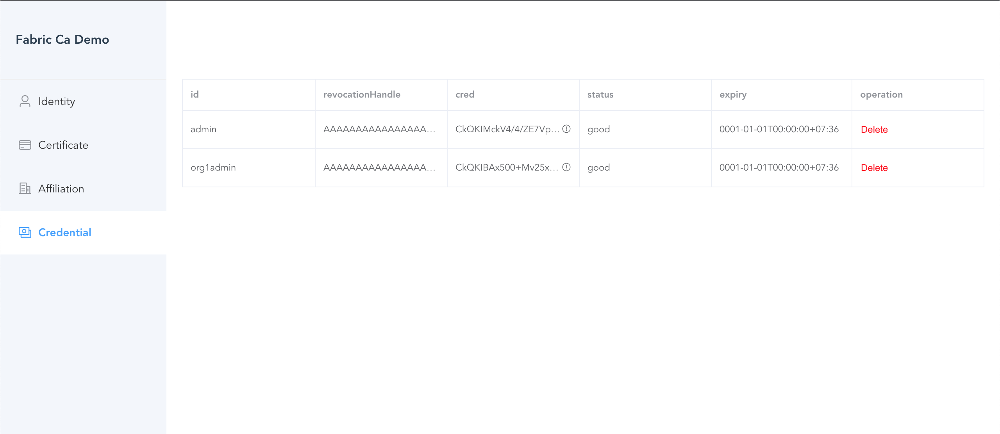

## Fabric Ca Demo
This repo demonstrates how to use fabric-ca to create certificates.

## Identity managerment

## Certificate enrollment

## Affiliation managerment

## Idmix credentials

## about key store
The user private key is stored in the client, not in the Fabric-CA. The client never shares its private key (as it is expected to). The client generates a key pair, submits a CSR to the CA and receives the signed certificate. The client saves the received certificate (the CA saves a copy, too)